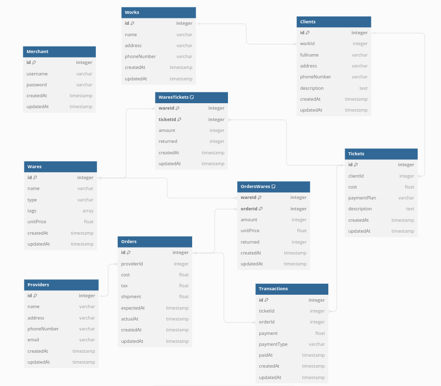

# Caption

Caption is a basic social media back-end application where there are users that can post photo where other people can comment under the photo and up or down vote the comments, similiar to the social media app called "reddit". The purpose of this project is to apply and cement my knowledge of the implementing web security and caching into a back-end applicaiton. In this project, web security inlcudes using https, authenticate and authorize, data security, preventing common attacks, and defensice coding in javascript. The schema for the database used is shown below:

### HTTPS

Https was used to run app locally using a self signed key and certificate.

### Authenticate and Authorize

Bcrypt is used to hash passwords into the database and authenticate clients input correct passwords my comparing the users inputs with a password hash in the database. Npm packages express-session and cookie-parser are implemented cookies into the app. Where I would authorize verified users using cookies to use protected routes.

### Data Security

Envrioments variables are used to carry sensitive data needed for the application to run such as the databases urls, cookie secrets, and Amazon S3 configurations. This is made using a .env file to store the variables and use the key-value pairs in the code using the dotenv npm package. A sample .env file called "sample.env " is produced so that one can reproduce their own .env file required to run the app.

### Protection against Common Attacks

The following are types of web attacks and how my app prevents them:

- Cross-Site Request Forgery (CSRF) attacks - using an csrf-csrf npm package to apply a double submit cookie pattern.
- SQL injections - using prepared statements on the ORM called sequelize.
- Cross-Site Scripting (XSS)
  - DOM-Based XSS - securing cookies through their configuration (httpOnly and secure are true) and using helmet npm package to automatically set http headers for security.
  - Reflected and Stored XSS - use express-validator for validation checks

### Defensive Coding in JS

The following are secure practices for javascript:

- Validating Regular Expressions - use safe-regex npm package to verify used regular expressions are safe.
- Lint - used eslint in javascript and vairious eslint plugins

### Caching

A Redis cache was used to cache image buffers from an AWS S3 bucket to quicken photo retrievals. Redis was also used to store key-value pairs for the purpose of rate limiting all routes, photos routes, and login POST route to prevent againts Denail Of Service (DOS) attacks and brute force attacks against authorization.

## Features

There are two types of users on this social media app regular users and admins. Users are regular clients without any permission to alter other users data whil admins can. Admins can only be created by directly using an sql query to set isAdmin column to true. Admins can delete other users account, photos, and captions. Admins cannot however update or create any of the users data.

Users can upload an image with a title to create a photo on caption. The title of the photo can later be updated. Then other users and themselves can create comment under that photos called captions. These captions have text that can be updated. Users can vote, only once, on these captions to add or subtract a vote value. A users can later update to the other vote value or delete a past vote.

Photos are retrieved in a multipart/form-data as the photo's buffer and the photo's data row as a json object. While the other data like users, captions, and votes are table data rows in the form of json objects.

## How to use

The following are the requirements:

- Download repository and install dependencies.
- Install nvm in you operating system and run "nvm use" in the project directory terminal to run a unified Node.js version of v18.0.0.
- Create a .env file on the outermost project directory (./) so you can fill out this file while going through this guide.
  - A sample.env file is provided to show all the required keys to fill out and has dummy values on how they should look like.
- Make a SSL certificate that should produce two needed files: a certificate file and a key file. Theses file should live in the outermost project directory.
  - A source on the bottom of the README is provided to get this SSL certificate that is called "How to Create an HTTPS NodeJS Web Service with Express".
  - Beware: a production environment should always have a trusted certificate.

Next, create a database and insert the url database into the respective key-value pair on the .env file. The following are the types of enviorments and when you need a database for the specific enviorment:

- development enviorment: If you would like a less strict version of the app.
- test enviorment: If you would like to run the tests.
- production enviorment: If you would like to use it in a more real use case.

Install redis locally for caching and rate limiters. Then create secret keys are needed for express-session and csrf-csrf cookies. After that, create an Amazon S3 bucket and fill out all the AWS related sensitive information required into an .env file.

Here are the following commands on the project directory terminal and their use:

- npm start-dev: initialize the app in a developement enviorment
- npm test: run all the tests
- npm no-pretests: run all tests without running pre-test commands

Note:

- The primary file that is executed for test is on "./test/main.js" which depends on other files to be ran to run individual test suites. I have commented all tests that depend on Amazon services so that tests can be ran without the Amazon related values on the .env file.
- To use protected routes one will have to save the CSRF token from the response payload on a succesful login. Then set the headers on their requests with "x-csrf-token" to equal the provided CSRF token.

### Beware: That running tests will reset all images uploaded on Amazon S3 bucket for all enviorments. I apologize for this inconvinience as I was unable to progress with making three sections on the S3 bucket as my free allowed usage ran out as I was about to add this final touch.

## Technologies

These are the technologies and/or frameworks used:

- Node.js (v18.0.0) - Javascript runtime
- Express.js - web application framework
- Mocha/Chai/Axios - suite of npm modules used for making tests
- Swagger - suite of tools for documenting APIs
- PostgreSQL - relational database
- Sequelize - object-related mapping (ORM) for postgresql
- Redis - non-relational database
- Visual Studio Code - code editor
- Amazon Simple Storage Service (Amazon S3) - object storage service offered by Amazon Web Services (AWS)

## Collaborators

I had no collaborators.

## License

MIT license

This is showed on the text file "LICENSE.txt" in the repository.

## What I learned

During this project I learned the following:

- Amazon S3
- Centralizing Errors
- MVC file structure
- Sequelize ORM
- Redis
- Axios
- Streams
- Buffers
- Database migrations
- Applying Code coverage
- Mutation testing
- Rate limiting
- Mock responses
- Faking data
- BDD assertion styles
- etc

## Whats next

Next in my learning journey I will review and learn more about the basics of back-end engineering, and touch lightly on dev ops.

## Sources

The following are the sources I used to learn and implement about new topics or techonologies that are not documentations:

- [Getting Started with Sequelize and Postgres](https://dev.to/nedsoft/getting-started-with-sequelize-and-postgres-emp)
- [CRUD REST API with Node.js, Express, and PostgreSQL](https://blog.logrocket.com/crud-rest-api-node-js-express-postgresql/)
- [Performing CRUD with Sequelize](https://dev.to/nedsoft/performing-crud-with-sequelize-29cf)
- [How to write a production-ready Node and Express app](https://www.freecodecamp.org/news/how-to-write-a-production-ready-node-and-express-app-f214f0b17d8c/)
- [How to Create an HTTPS NodeJS Web Service with Express](https://adamtheautomator.com/https-nodejs/)
- [Node.js Error Handling Made Easy: Best Practices On Just About Everything You Need to Know](https://sematext.com/blog/node-js-error-handling/)
- [Node.JS Best Practices](https://github.com/goldbergyoni/nodebestpractices)
- [Integration Test Best Practices](https://github.com/testjavascript/nodejs-integration-tests-best-practices)
- [Javascript and Node.js Best Practices](https://github.com/goldbergyoni/javascript-testing-best-practices)
- [How to Set Up Redis for Caching in Node.js](https://betterstack.com/community/guides/scaling-nodejs/nodejs-caching-redis/)
- [Upload Images to S3 from Node Back End](https://dev.to/thesameeric/how-to-validate-uploaded-files-in-node-js-2dc4)
- [How to validate uploaded files in Node JS](https://dev.to/thesameeric/how-to-validate-uploaded-files-in-node-js-2dc4)
- [A Complete Guide to Winston Logging in Node.js](https://betterstack.com/community/guides/logging/how-to-install-setup-and-use-winston-and-morgan-to-log-node-js-applications/)
